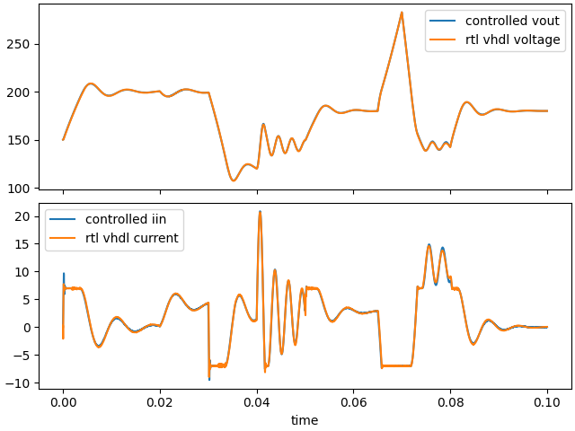

# Tube amplifier power supply

This is a repository for a tube amplifier power supply FPGA control. The power supply consists of a PFC, 6.3V/10A LLC, 420V/1A dual active half bridge and an fpga to contorl them. The auxiliary supplies are also provided by a DCM flyback converter built around IW1818. This power supply was designed originally during university studies and finished in 2017. 

For more detailed information, please refer to the [PDF documentation](docs/tube_amp_power.pdf).

The power supply was never installed in the actual tube amplifier and the original repository was lost at some point when changing computers hence this repository picks up at the point which was recovered from some old copy that I happened find from my old hardrive.

## hVHDL libraries
 [hvhdl project on GitHub](https://github.com/hvhdl) has the required fixed and floating point math libraries and microcode processor libraries so we will refactor the old control code to use them. The hVHDL libraries come with VUnit tests hence the code is easier to refactor to use the existing tested libraries than to simulate the functionality with the implementations that are present in this repository.

## HIL simulation and its verification against QSPICE simulation

Since the system is relatively complicated, a HIL simulation will be created to test overall control and trip functionality with target control hardware. The VHDL HIL simulation models are verified by comparing the HIL simulation results with same simulations run using QSPICE. QSPICE allows us to write the control and modulation code in C++ which are compiled to DLL and run inside the spice simulation. 

The HiL simulation will be done using the hVHDL microcode processor libraries in order to run the simulation in floating point. There are various versions of the control hardware available so we will at least run it using Spartan 7 and Cyclone 10 LP.

The HiL simulation is implemented in floating point and calculations are run using microprogramming. The design of the microprogram processor is documented in a [series of blog posts about processor and its software design in VHDL](https://hardwaredescriptions.com/category/processor-design/)

The C++ sources for QSPICE model verification requires CMake and the .dll needs to be generated with 32bit platform. 
Example using Visual Studio compiler

cmake -G "Visual Studio 17 2022" -DCMAKE_GENERATOR_PLATFORM=Win32 ..

the project can be built then using

cmake --build .

how to run build

1. mkdir build
2. cd build
3. cmake -G "Visual Studio 17 2022" -DCMAKE_GENERATOR_PLATFORM=Win32 ..
4. cmake --build .

after running cmake --build . all dll will be built and copied to the folders where the qspice simulations hence the simulations can be run with either the included plot_<simulation>.py or directly using qspice ide.

The QSPICE simulations can be found in hil_simulation/qspice_ref_models/

The rtl simulation results can be using open source [NVC](https://github.com/nickg/nvc) simulator. This can be installed with 

winget install --id=NickGasson.NVC -e

NVC needs to be run in MSYS2 environment. To run vunit with NVC in MSYS2, three environmental variables need to be set, PATH for python which has vunit installed, VUNIT_NVC_PATH to the NVC/bin folder and VUNIT_SIMULATOR to tell vunit to use NVC

example script is provided for the authors machine with the msys2_script.sh found in the root of this repository.

The models are done individually and the combined model can be found in the guitar_power_supply
